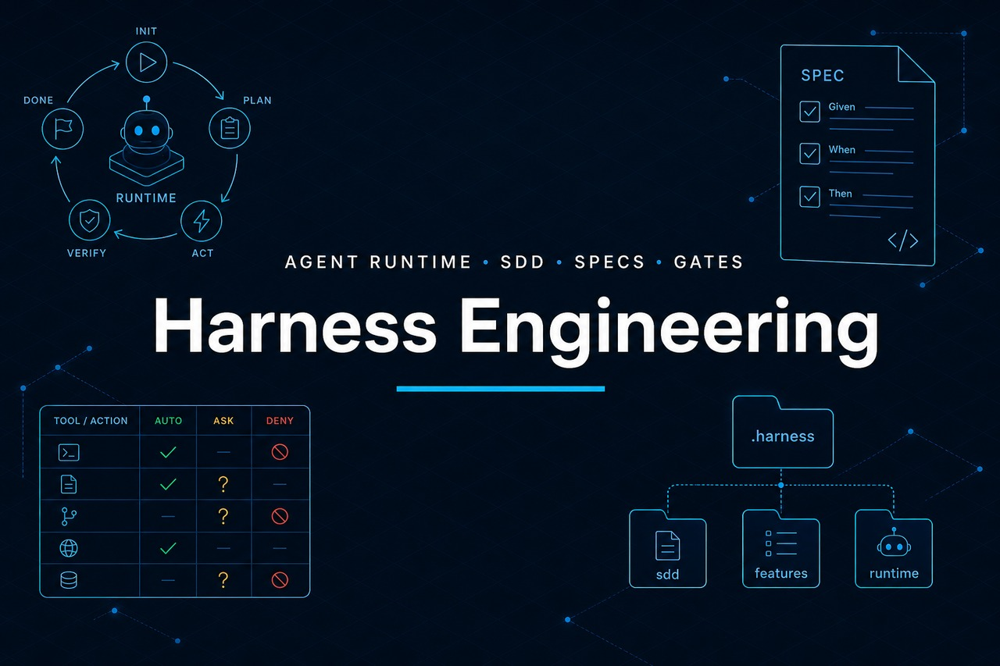

<p align="center">
  
</p>

# AI Engineering Harness

Kit **open template** de engenharia com IA para qualquer empresa ou produto.

Camada **operacional** no repositório: Knowledge, Specification, Agents, Workflows, Tools, Governance e Runtime. Funciona com Cursor, GitHub Copilot, Claude Code, Windsurf, Continue, Aider, JetBrains AI, Codex e qualquer ferramenta com instructions/rules.

## Modelo

```text
.ai-harness/
├── Knowledge/       Architecture · Domain · Standards · ADR
├── Specification/   Requirements · Use Cases · Acceptance (por feature)
├── Agents/          Architect · Developer · Reviewer · Tester
├── Workflows/       Feature · Bug · Refactoring · Migration
├── Tools/           Build · Test · Git · Validation
├── Governance/      Security · Quality · Architecture · Cost · Permissions
└── Runtime/         Loop · Runs · Sandbox
```

## Relação com SDLC corporativo

```text
Governança da empresa              Harness (execução no repo)
─────────────────────────          ─────────────────────────
Fases e quality gates              Workflows + Runtime gates
Política de uso de IA              Governance/permissions.md
DoR / DoD                          Specification acceptance + DONE
Playbook de squads                 AGENTS.md + Agents/*
Charter / compliance               Knowledge + Governance
```

Mapa: [docs/sdlc-mapping.md](docs/sdlc-mapping.md).

## Estrutura deste repositório

```text
harness-engineering/
├── README.md
├── banner.jpg
├── docs/
│   ├── adoption-guide.md
│   ├── sdlc-mapping.md
│   ├── ide-adapters.md
│   └── rules-baseline.md
├── template/                 → copia para <projeto>/.ai-harness/
├── adapters/                 Cursor, Copilot, Claude, Windsurf, …
└── scripts/init-harness.sh
```

## Início rápido

```bash
./scripts/init-harness.sh /caminho/projeto MeuApp \
  --adapters=cursor,copilot,claude,windsurf,continue,aider,agents-md,jetbrains

# só o harness
./scripts/init-harness.sh /caminho/projeto MeuApp --adapters=none
```

Depois: preencher `Knowledge/`, ajustar `Tools/` + `Governance/`, criar features em `Specification/features/`.

Guia: [docs/adoption-guide.md](docs/adoption-guide.md) · Adapters: [docs/ide-adapters.md](docs/ide-adapters.md) · Regras: [docs/rules-baseline.md](docs/rules-baseline.md).

## Princípios

- Spec antes de código — sem aceite → `BLOCKED`.
- **Código e testes sempre por feature** (`template/Knowledge/Standards.md`).
- **OSS primeiro** — cloud proprietário só com ADR (`template/Governance/cost.md`).
- Aceite = testes (**AC-T\***) ou lacuna justificada (**AC-G\*** + stub).
- Workflow orquestra; Agent executa o papel.
- IA produz; humano aprova o que for `ask`.
- Knowledge + Governance > preferência do modelo.
- Agnóstico de cloud, stack e IDE.

## Licença

[LICENSE](LICENSE) (MIT).
